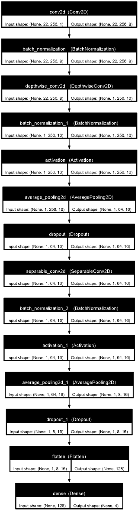

# EEG-Net

Compact CNN for 4-class motor imagery BCI (22ch EEG, 128Hz, 2s epochs).

## Performance
| Split | Accuracy |
|-------|----------|
| Train | 84.2% |
| Val   | 89.7% |
| **Test** | **72.9%** |

## Features
- **EEGNet v4** (2k params): Temporal → Depthwise → Separable convs
- BCI Competition IV Dataset 2a (sub-008)
- Z-score norm, Keras SGD training
- Confusion matrices + topography plots

## Files
- `CNN_EEGNET.ipynb`: Train/eval notebook
- `utils.py`: Data loader + model def
- `topoplot_python.py`: EEG spatial viz
